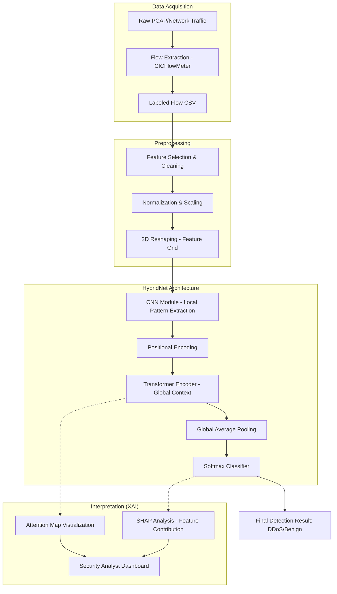

# Methodology Pipeline: Explainable HybridNet

This document details the architectural pipeline for the proposed Explainable HybridNet, a lightweight framework combining CNN and Transformer architectures for DDoS detection in IoT/Edge and Cloud/SDN environments.

## 1. Pipeline Overview

The pipeline is divided into four main stages: Data Acquisition, Preprocessing, Hybrid Learning (CNN + Transformer), and Interpretation (XAI).

### Stage 1: Data Acquisition
- **Sources:** Real-time network interfaces or offline PCAP/CSV benchmarks (CIC-DDoS2019, CIC-IoT-2023).
- **Tooling:** CICFlowMeter or custom packet parsers to convert raw packets into flow-based features (Total Fwd Packets, Flow Duration, etc.).

### Stage 2: Data Preprocessing
- **Feature Selection:** Identifying discriminative features using Gain Ratio or Correlation analysis.
- **Normalization:** Min-Max scaling or Z-score normalization to ensure balanced weight updates.
- **Reshaping:** Flow features (vector) are reshaped into 2D matrices (e.g., $8 \times 8$ or $10 \times 10$) to leverage CNN's spatial extraction capabilities.

### Stage 3: Hybrid Architecture (HybridNet)
The model follows a sequential-parallel hybrid design:
1.  **CNN Backbone:** 
    - 2D Convolutional layers with small kernel sizes ($3 \times 3$).
    - Captures local correlations between adjacent network flow features.
    - Batch Normalization and ReLU activation for stability.
2.  **Positional Encoding:** Adds temporal/spatial context before the Transformer stage.
3.  **Transformer Encoder (Lightweight):**
    - Multi-Head Self-Attention (MHSA) to model global dependencies across the entire flow.
    - Feed-Forward Networks (FFN) with dropout to prevent overfitting.
    - Limited layers (2-4) to maintain "lightweight" requirements.
4.  **Classification Head:** Global Average Pooling followed by a Softmax/Sigmoid dense layer.

### Stage 4: Explainable AI (XAI)
- **Local Interpretation (Attention):** Visualizing Transformer attention maps to identify which specific features (e.g., source port, packet length) the model "looked at" for a specific decision.
- **Global Interpretation (SHAP):** Calculating Shapley values to rank overall feature importance across the dataset, validating that the model isn't relying on "noisy" features (like Timestamp).

---

## 2. Methodology Diagram

## 3. Lightweight Optimization Strategy
To ensure the model is "future-proof" and "faster" as requested:
- **Optimization:** Use **PyTorch Quantization** (Post-Training Quantization or Quantization Aware Training) to convert weights from FP32 to INT8.
- **Efficiency:** Pruning redundant neurons in the CNN stage that show near-zero SHAP values.
- **Latency:** Benchmark inference time on CPU (Edge-like) vs GPU (Cloud-like).
